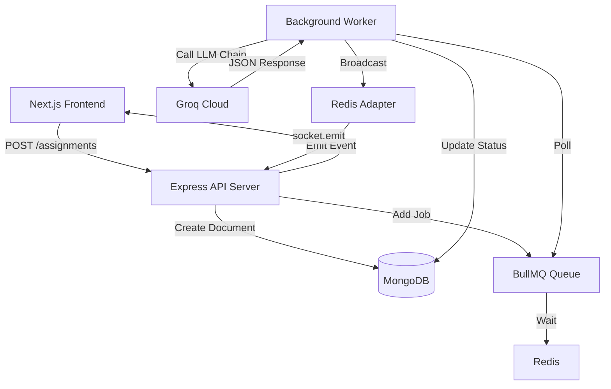

# VedaAI - AI Assessment Creator (Hiring Assignment)

VedaAI is a premium, full-stack monorepo application designed to generate professional, structured assessment papers from any source content (Text or PDF) using a robust 4-tier LLM failover chain.


## ✨ Premium Features

- **🎨 High-Fidelity Figma UI**: A modern, card-based interface with pixel-perfect implementation of the VedaAI hiring design.
- **🛡️ 4-Tier LLM Failover**: Automatic fallback system (Llama 8B → Llama 70B → Mixtral → Gemma) ensuring 100% generation reliability.
- **📄 Instant PDF Extraction**: Client-side PDF processing for immediate context extraction from study materials.
- **⚡ Real-time Pipeline**: Live status tracking (Queued → Processing → Completed) powered by Socket.IO and Redis.
- **🎓 Academic Branding**: Professional exam layouts featuring school branding, student info grids, and `[Difficulty]` tags.
- **🖨️ Print-Ready**: Aggressive print CSS optimization for high-quality examination papers with a single click.

---

## 🏗️ Monorepo Structure

This project is organized as a unified monorepo for easier deployment and maintenance:

- **/frontend**: Next.js 14 App Router, Tailwind CSS, Zustand, Socket.IO Client.
- **/backend**: Node.js Express API, BullMQ Worker, MongoDB, Redis.
- **/docker-compose.yml**: Orchestrates the entire stack (App, Worker, DB, Redis).

---

## 🛠️ Architecture



---

## 📦 Getting Started

### Prerequisites
- Docker & Docker Compose
- Node.js 18+
- [Groq API Key](https://console.groq.com/)

### Configuration
Create a `.env` file in the **root** directory (used by Docker Compose):
```env
GROQ_API_KEY=your_key_here
```

### 🚀 Running with Docker (Quickest)
```bash
docker-compose up --build -d
```
- **Frontend**: http://localhost:3000
- **API**: http://localhost:5000

---

## 🧪 Testing the Pipeline
A comprehensive [Testing Guide](./brain/testing_guide.md) is provided in the artifacts directory, including:
- **Low-Load Test Cases**: To avoid rate limits during verification.
- **File Upload Checks**: Automated PDF text extraction verification.
- **Failover Verification**: How to test the multi-model fallback system.

---

## 📑 Deployment
See the [Deployment Guide](./brain/deployment_guide.md) for instructions on scaling the workers and hosting on platforms like Vercel and Railway.
